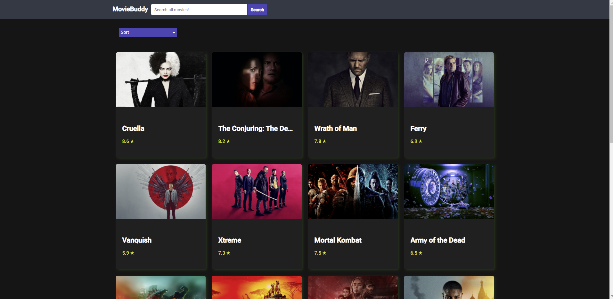
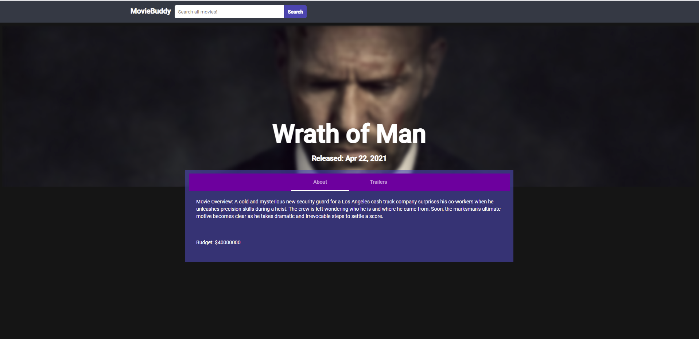
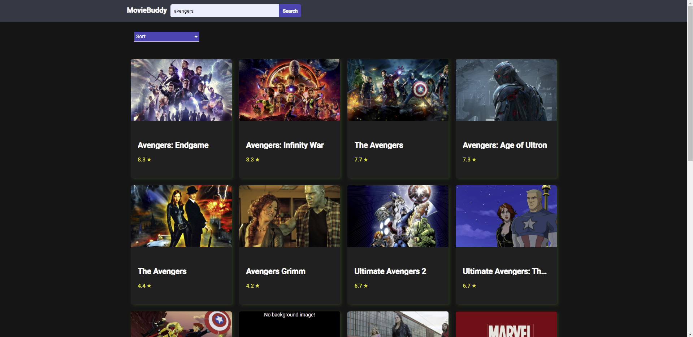

# MovieBuddy
WebApp built with Angular where users can browse popular movies, search for movies and sort results.

-Main page

-Users can browse through popular movies, sort and load more movies

-Movie page

-Users can explore movies for more details and trailers (if available)

-Movie search

-Users can search for movies and sort results

